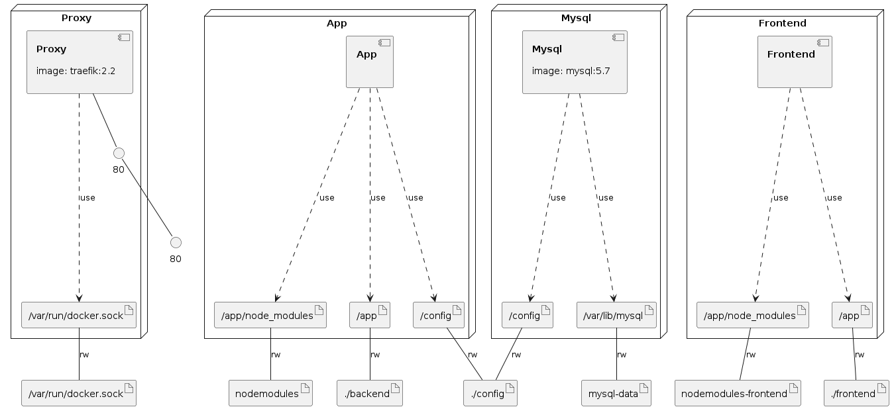

# DockerCon 2020 Talk Resources

This repo contains the resources I used for my DockerCon 2020 talk.

## Links

- [Talk](https://www.youtube.com/watch?v=QeQ2MH5f_BE)
- [Slides](https://docs.google.com/presentation/d/1HqEPAjQgiuyWUf7ere9b66xXsIf4I44JYKit9bRRNKw/edit?usp=sharing)

## Tags

Throughout the talk, we follow an application as it evolves. The tags below provide the order of evolution.

1. compose
1. compose-multi-stage
1. mysql
1. split-frontend
1. api-tests

### Infrastructure model

